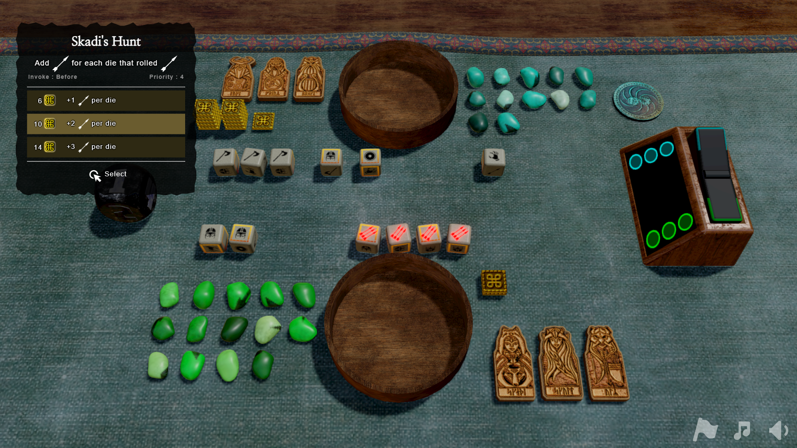
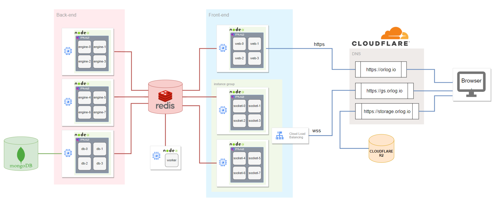

# Orlog Online

## 📽 [▶ 유튜브 플레이 영상 보기](https://www.youtube.com/watch?v=zSa8XJc0aY4)

# 1. Orlog 란?
- Ubisoft의 「Assassin's Creed: Valhalla」에 등장하는 주사위 기반 보드게임
- 6개의 주사위와 3장의 특수 카드를 사용해 상대방의 체력을 먼저 제거하는 방식의 간단한 미니게임
- 게임속 NPC와의 대전을 통해 잠입액션이라는 본작과는 다른 재미를 유저들에게 선사

# 2. 개발 이유
- NPC와의 대전만을 지원하는 원작과 달리 온라인 PvP 버전의 팬메이드 게임을 개발
- 접근성을 위해 `웹게임`으로 개발
- 프론트엔드와 백엔드 영역을 직접 경험하여 개발 실력 향상
- 원작 게임을 향한 팬심

# 3. 프로젝트 목표
- 실제 운영을 목표로 두고 개발 진행
- 실력 향상을 위해 가능한 많은 기능들을 자체구현 할 것
  - 상용게임엔진(Unity Engine 등) 미사용
- 수평 및 수직적 성능 확장 가능
- 각 서버들은 컨테이너로 분리

# 4. 시스템 개요

> 위 이미지는 `Node`당 웹소켓 동시접속자 3000명 시나리오를 가정하고 진행한 부하 테스트 당시의 시스템 개요도 이다. 실제 운영 당시에는 단일서버 환경에서 축소된 상태로 가동되었음.

> 이벤트루프를 싱글스레드로 관리하는 Node의 특성상 성능 확장을 위해선 필연적으로 Node 인스턴스의 갯수를 늘려야만 한다. 다중 Node 환경에서의 시스템 정상 가동 여부 및 부하분산 테스트를 위해 다수의 시스템을 가동하였음

## 4-1. 구조 요약
- 서버는 역할에 따라 Front-End와 Back-End 영역으로 나뉘며, 유저와 직접 통신 가능한 API 제공 여부에 따라 역할군을 나눔
    - Front-end :
        - `WebSocketServer`  : 유저와 소켓 연결을 통한 실시간 통신
        - `WebServer` : 브라우저를 통해 HTML/JS 번들을 전달
    - Back-end:
        - `GameLogicServer` : 게임플레이시 로직을 수행
        - `DBTransactionServer`: Mongo DB의 트랜잭션 관리
- 모든 서버는 **Redis 채널을 통해 서로 메시지를 주고받으며**, 유저 간 매칭, 게임 상태 전달, 로그 기록 등의 역할을 수행한다.
- 클라이언트는 **WebSocket**을 통해 실시간 상태를 전달받으며, 게임 렌더링은 브라우저에서 **Three.js**를 통해 수행된다.
- 3D 모델, 사운드, 텍스처 등 용량이 큰 리소스는 `Cloudflare R2`에 저장되어 다운로드 트래픽을 분산시킨다.

# 5. 기술 스택

| **영역** | **기술** |
| --- | --- |
| **클라이언트 렌더링** | **Three.js** (WebGL 기반 3D) |
| **서버 플랫폼** | **Node.js (ES6)** |
| **인프라** | **GCP Compute Engine**, **PM2** |
| **컨테이너화** | **Docker** — 단일 머신에서 다수의 서버 기능(WebSocket, 로직, 트랜잭션 등)을 **역할별 분리** |
| **부하분산** | **GCP Load Balancer** |
| **서버 간 통신** | **Redis Pub/Sub** |
| **데이터베이스** | **MongoDB** |
| **리소스 CDN** | **Cloudflare R2** |
| **도메인 & HTTPS** | **Cloudflare DNS + SSL** |

# 6. 이 프로젝트로 증명한 실무 역량

1. **실시간 게임 트래픽 처리 경험**
   - Node.js 기반 로직 서버 + WebSocket 서버 분리 구조
   - Redis Pub/Sub을 이용한 다중 서버 간 유저 매칭/통신 구현
   - 서로 다른 서버에 붙은 유저들 간 실시간 PvP 완전 구현
   - 부하 테스트 도구 제작 → 동시 접속자 3,000~10,000 명 테스트 성공

2. **운영 환경 구축 및 최적화**
   - GCP Load Balancer + PM2 + Docker로 서버 자동 확장 구조 구성
   - Redis `zAdd`, `zRemRangeByScore` → 매칭 큐/스케줄링 로직 구성
   - Redis Lua Script로 DB 락 없이 atomic 갱신 로직 구현

3. **서비스 최적화 및 보안**
   - OAuth 기반 사용자 인증과 WebSocket 연결 연동
   - Cloudflare R2 CDN 적용 → 클라이언트 자산 전송 최적화 및 비용 절감

4. **개발 외 요소: 테스트 및 검증**
   - CLI 기반 부하 테스트 스크립트 직접 구현
   - 다양한 트래픽 시나리오 대응 (1:1, 병렬 접속, 재접속)

👉 **이 프로젝트는 단순한 게임 구현이 아니라,  
실시간 네트워크 서비스의 설계·개발·운영을 1인으로 감당한 기록입니다.**

# 7. 상세 설명
본 프로젝트에 대한 보다 자세한 기술적 설명은 아래 첨부된 링크에서 확인가능하다.

[Detail Document]
https://lowly-pearl-d16.notion.site/Orlog-1ee78606e97b80dd924ed7fb2d4e7f89

# 8. 빌드 & 가동 가이드
본 프로젝트의 빌드 & 가동 가이드는 아래 문서에서 확인 가능하다.

[Build & Run Guide]
https://grand-pajama-ca5.notion.site/orlog-io-1f2e6f9328198025817df2fd8a7affb6
